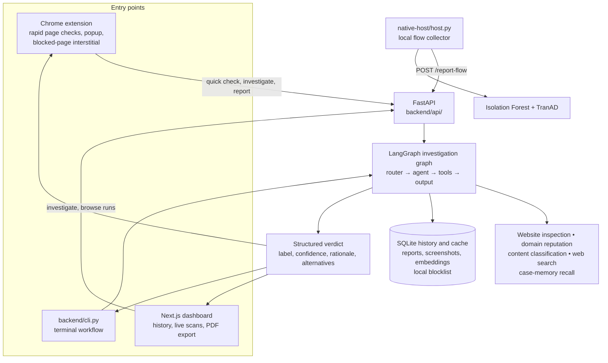
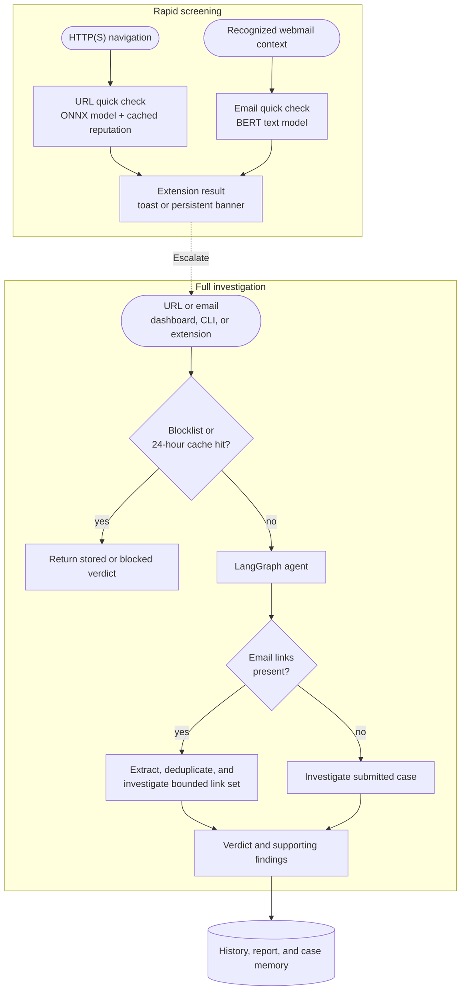
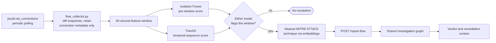
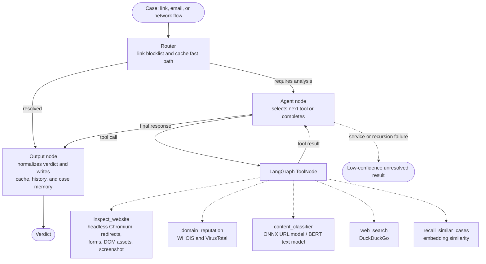

# Security Co

Security Co is a local-first cybersecurity research prototype for investigating suspicious links, email content, and network-flow anomalies. It combines a Chrome extension, a Next.js dashboard, a command-line interface, and a [LangGraph](https://github.com/langchain-ai/langgraph)-orchestrated investigation service. The system produces an evidence-oriented verdict—`dangerous`, `suspicious`, or `safe`—with a confidence estimate, rationale, and, where relevant, links to likely legitimate destinations.

> **Prototype notice.** Security Co is intended for evaluation, education, and controlled experimentation. It is not a substitute for professional incident response, endpoint protection, or human review. Model outputs, reputation data, and external services can be incomplete, unavailable, or wrong; no verdict is a guarantee of safety.

## Contents

- [Capabilities](#capabilities)
- [Architecture](#architecture)
- [Quick start](#quick-start)
- [Chrome extension](#chrome-extension)
- [Dashboard](#dashboard)
- [Network anomaly detection](#network-anomaly-detection-local-traffic)
- [Repository layout](#repository-layout)
- [Status and limitations](#status-and-limitations)
- [License](#license)

## Capabilities

Security Co separates inexpensive, deterministic checks from deeper, tool-assisted investigation. This reduces unnecessary model calls while preserving an escalation path for ambiguous or higher-risk cases.

- **URL and email screening.** The extension and API expose fast checks using local URL and text classifiers, cached reputation data when configured, and a full investigation path for URLs or email content.
- **Evidence collection.** A headless-browser inspection tool can record redirects, page structure, forms, selected DOM assets, response metadata, and a screenshot. The investigator may also use WHOIS and VirusTotal data, content classification, web search, and similarity recall over prior cases.
- **Email link analysis.** The email workflow extracts links, deduplicates domains, and can investigate individual links alongside the message text. This keeps content and destination signals distinct.
- **Brand-impersonation support.** When an investigation identifies a likely brand mismatch, web search can be used to surface plausible legitimate destinations for review.
- **Local case records.** SQLite-backed history, per-case Markdown reports, screenshots, and dashboard-generated PDF exports make investigations inspectable after the fact.
- **User-controlled blocking and reporting.** A confirmed-dangerous domain may be added to Security Co's local blocklist and submitted to VirusTotal when a VirusTotal API key is configured. This is a reporting workflow, not an offensive capability.
- **Network-flow anomaly analysis.** A local helper aggregates connection metadata into time windows, evaluates those windows with Isolation Forest and TranAD models, maps escalated flows to a nearest MITRE ATT&CK technique, and sends the resulting context to the same investigation service.

## Architecture

The diagrams below describe the current repository structure and data flow. They are intentionally explicit about local components and the distinction between rapid screening and full investigation.

### 1. System overview



### 2. Link and email investigation



### 3. Local network anomaly workflow



### 4. Investigation graph



For a file-by-file backend reference, see [backend/README.md](backend/README.md).

## Quick start

### 1. Clone and install

```bash
git clone https://github.com/quixoticalcoder/security-co.git
cd security-co
./download_everything.bash
```

The setup script creates a repository-root virtual environment, installs Python dependencies and Playwright Chromium, warms model caches, and installs/builds the extension dependencies.

### 2. Configure credentials

Copy the example configuration and set the credentials appropriate to your environment:

```bash
cp backend/.env.example backend/.env
$EDITOR backend/.env
```

- `OPENROUTER_API_KEY` is required for LLM-assisted investigations. Security Co uses OpenRouter's OpenAI-compatible interface; obtain a key at [OpenRouter Keys](https://openrouter.ai/keys). The configured model must support tool calling; available models are listed at [OpenRouter Models](https://openrouter.ai/models).
- `VT_API_KEY` is optional. It enables VirusTotal reputation lookups and the report-and-block submission flow. Create an account at [VirusTotal](https://www.virustotal.com/gui/join-us).

If the LLM service is unavailable or rejects the request, the application is designed to return an unresolved, low-confidence result rather than silently presenting a definitive conclusion.

### 3. Start the application

```bash
./run_all.bash
```

`run_all.bash` launches the backend, local network helper, and dashboard. On a first run, it can train the network models and build the MITRE ATT&CK index. The index download is approximately 500 MB. To start only the backend and dashboard, use `./start_all.bash`; `WITH_NATIVE_HOST=0` and `WITH_DASHBOARD=0` can disable individual components.

Open [http://localhost:3000/](http://localhost:3000/) for the dashboard, or use the CLI:

```bash
source .venv/bin/activate
cd backend
python cli.py link https://example.com
python cli.py email
```

### Manual setup

```bash
python3 -m venv .venv
source .venv/bin/activate
pip install torch --index-url https://download.pytorch.org/whl/cpu
pip install -r backend/requirements.txt
playwright install chromium
cp backend/.env.example backend/.env

cd backend
uvicorn api.app:app --reload --port 8010
```

In a second terminal, start the dashboard:

```bash
cd dashboard
pnpm install
NEXT_PUBLIC_API_BASE_URL=http://localhost:8010 pnpm dev
```

### Startup scripts

| Script | Purpose |
|---|---|
| `download_everything.bash` | One-time local setup: virtual environment, dependencies, Chromium, model cache, and extension build. |
| `run_all.bash` | Starts backend, network helper, and dashboard; prepares models/indexes when absent. |
| `start_all.bash` | Starts backend and dashboard without the local network helper. |

All scripts expect `.venv/` at the repository root.

## Chrome extension

1. Start the backend with `./start_all.bash` or the manual setup above.
2. Build the extension with `cd extension && npm install && npm run build`. `download_everything.bash` performs this during first-time setup.
3. Open `chrome://extensions`, enable **Developer mode**, select **Load unpacked**, and choose `extension/dist/`.
4. Browse to an HTTP(S) page. The extension performs a rapid local check and displays a non-intrusive result for lower-risk cases or a persistent banner for cases needing attention.
5. Select the **Security Co** toolbar icon to investigate the current URL or page text. On supported webmail sites, the popup also offers email screening and escalation to a full scan.
6. For a confirmed-dangerous result, **Report & block** adds the domain to the local blocklist and, when configured, submits a malicious vote to VirusTotal.

If the backend is not at `http://127.0.0.1:8010`, update the endpoint in the extension settings. Extension-specific implementation notes are in [extension/README.md](extension/README.md).

## Dashboard

The separate Next.js dashboard in `dashboard/` provides run history, live scan progress, detailed findings, and client-generated PDF exports. A run detail page may include the browser screenshot, redirect and form information, selected DOM and hosting signals, available VirusTotal data, and recalled similar cases. Light and dark themes persist across navigation.

## Network anomaly detection (local traffic)

`native-host/host.py` is a local Python process that reports to the backend; it is not a Chrome native-messaging bridge. Its data path is illustrated in architecture diagram 3.

1. **Collect.** `backend/network/flow_collector.py` polls `psutil.net_connections`, compares snapshots, and aggregates connection metadata—not packet payloads—into 60-second feature windows.
2. **Score.** `backend/network/isolation_forest.py` evaluates individual windows. `backend/network/tranad.py` evaluates sequences, which can expose temporal patterns that are not unusual in a single window. A result is escalated when either model flags it.
3. **Contextualize.** `backend/mitre/lookup.py` finds a nearest MITRE ATT&CK technique using SecureBERT embeddings. The helper sends this context to `/report-flow`, where the regular investigation service produces a verdict and available remediation guidance.

Run the helper independently after the backend starts:

```bash
source .venv/bin/activate
python native-host/host.py --backend-url http://127.0.0.1:8010
```

### Train models and build the index

`run_all.bash` performs these steps when the assets are missing. To rebuild them manually:

```bash
source .venv/bin/activate
cd backend

python ../scripts/train_isolation_forest.py
python ../scripts/train_isolation_forest.py --feature-set window
python ../scripts/train_tranad.py
python -m mitre.build_index
```

The repository includes small sample datasets for smoke testing in `backend/data/network_datasets/`. For meaningful evaluation, train on representative data and assess performance in the intended environment. Public sources referenced by the project include [CICIDS2017](https://www.unb.ca/cic/datasets/ids-2017.html) and [NSL-KDD](https://www.unb.ca/cic/datasets/nsl.html); pass a dataset path with `--input <your.csv>` where supported.

### Demonstration triggers

```bash
source .venv/bin/activate

# Submit a staged anomalous flow directly to the backend.
python scripts/staged_flow_trigger.py post --backend-url http://127.0.0.1:8010

# Generate failed outbound connections for the local helper to observe.
python scripts/staged_flow_trigger.py live

# Replay recorded CICIDS2017 attack-flow data through the pipeline.
python scripts/replay_attack_flow.py --backend-url http://127.0.0.1:8010
```

## Repository layout

```text
backend/        FastAPI service, LangGraph investigation agent, network models, MITRE mapping, and case memory.
dashboard/      Next.js dashboard for history, scans, run detail, and PDF export.
extension/      Chrome Manifest V3 extension for rapid checks, popup actions, banners, and block interstitials.
native-host/    Local flow-collection helper that reports anomalies to the backend.
scripts/        Model-training utilities and staged/replay demonstration triggers.
Presentation/   Project presentation assets and network-model evaluation materials.
download_everything.bash  First-time environment and extension setup.
run_all.bash              Full local stack launcher.
start_all.bash            Backend and dashboard launcher.
```

## Status and limitations

The checked-in implementation includes the investigation graph, rapid URL and email checks, FastAPI routes, CLI, dashboard, local history/reporting, website inspection, case-memory recall, local blocklisting, extension workflows, network-flow collection, Isolation Forest and TranAD model code, and MITRE ATT&CK lookup code.

The project remains a proof of concept. In particular:

- Security Co has no authentication or multi-user isolation; it should not be exposed as an internet-facing service without an appropriate security design.
- External intelligence and model-based findings are advisory. Validate material decisions with trustworthy sources and qualified human review.
- Network models are sensitive to the training data, environment, thresholds, and normal-traffic baseline. The bundled CSV files are smoke-test samples, not evidence of general detection performance.
- The multi-link email workflow is implemented, but its behavior should be validated with representative, authorized test mail before operational use.
- The local helper records connection metadata rather than payloads; this reduces data collection but also constrains what can be inferred.
- The repository does not implement per-user continual retraining from local traffic.

## License

Provided as-is for evaluation and demonstration purposes.
